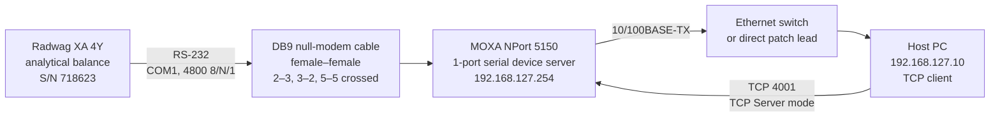
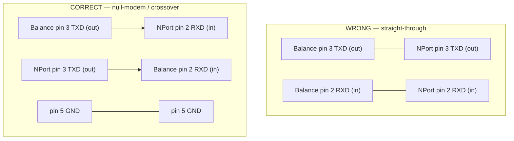
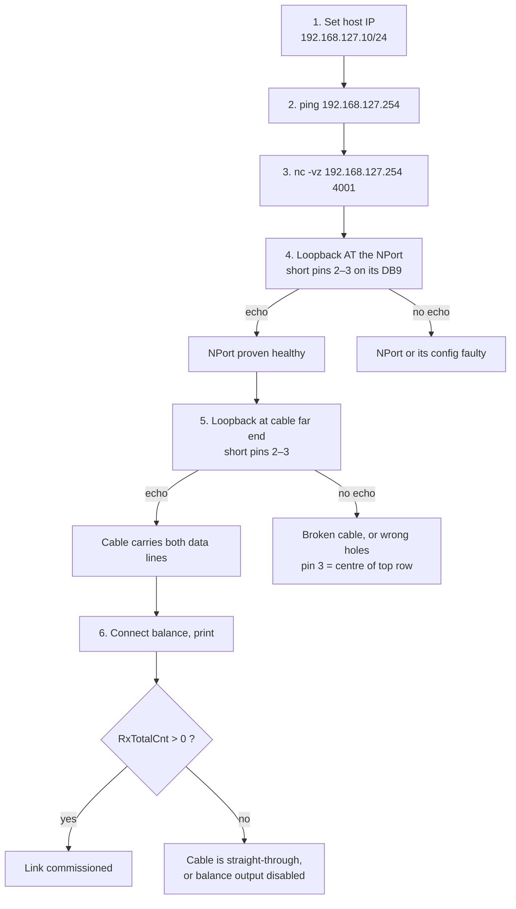
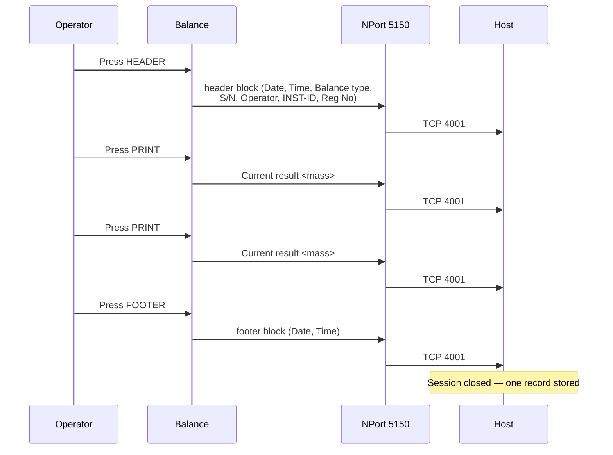

# Balance → Network Integration: Hardware Process Document

Radwag XA 4Y analytical balance to Ethernet via MOXA NPort 5150.

## 1. Physical chain



## 2. Why the cable must be null-modem

Both ends are **DTE**. A straight-through cable wires TXD→TXD and RXD→RXD, so no
byte can ever cross. This was the original fault on this installation: two
straight-through cables were tried and the NPort's `RxTotalCnt` stayed at **0**
through every software permutation.



**DB9 pin numbering is mirrored between genders.** Viewed face-on:

| | Top row (five), left → right | Bottom row (four), left → right |
|---|---|---|
| Male (pins) | 1 2 3 4 5 | 6 7 8 9 |
| Female (sockets) | 5 4 3 2 1 | 9 8 7 6 |

Pin 3 is always the **centre hole of the top row** — immune to counting
direction. Use that as your reference.

## 3. NPort 5150 configuration

| Setting | Value |
|---|---|
| IP address | 192.168.127.254 / 255.255.255.0 |
| Operating mode | **TCP Server** |
| Local TCP port | **4001** |
| Command port | 966 |
| Max connection | 1 |
| Interface | RS-232 |
| Baud rate | **4800** (must equal the balance) |
| Data / stop / parity | 8 / 1 / None |
| Flow control | None |
| FIFO | Enable |

Web console: `http://192.168.127.254`, default password `moxa`.

**Only one TCP client at a time.** With `Max connection = 1`, a second client is
refused. Stop one tool before starting another.

**Submit is not Save.** Serial changes require *Save/Restart* to take effect.
Verify the live value over SNMP rather than trusting the form:

```bash
snmpget -v1 -c public 192.168.127.254 1.3.6.1.2.1.10.33.2.1.5.1   # live baud
```

## 4. Balance configuration

```
SETUP → Communication → COM1          4800, 8, 1, None
SETUP → Peripherals → Printer  → Port     RS 232 (1)
SETUP → Peripherals → Computer → Port     RS 232 (1)
SETUP → Databases → Universal variables   Var 1 = INST-ID, Var 2 = Reg No
```

Code page: **1250**. Decode received text as `cp1250`, not ASCII.

**Assign only ONE peripheral to COM1.** If both Printer and Computer point at
RS 232 (1), every printout is transmitted **twice** — once per device.

## 5. Commissioning sequence



## 6. Diagnostic ground truth

The NPort's own byte counters are the authoritative test — read them at
`Monitor → Async` in the web console, or `Mn_asyn.htm`:

| Reading | Meaning |
|---|---|
| `TxTotalCnt` rising, `RxTotalCnt = 0` | NPort transmits; **nothing** returns. Physical fault — cable polarity, or balance not transmitting. |
| `RxTotalCnt` rising, data unreadable | Wire is fine; **baud/framing mismatch**. |
| Both rising, data readable | Link healthy. |

**A baud mismatch still increments `RxTotalCnt`** (with garbage). `RxTotalCnt`
staying at exactly 0 therefore rules baud rate out and proves a physical break.
That distinction is what isolates a wiring fault from a configuration fault.

Handshake lines are also readable there. `DSR` going **ON** when the balance is
connected proves the balance is powered and asserting DTR.

## 7. Data flow at runtime



Bursts are **CRLF-terminated** lines of `Label` + 2-or-more spaces +
right-aligned `Value`. The balance sends **no record separator**, so record
boundaries are determined by an idle gap in transmission.

An **adjustment (internal calibration) report** is standalone — it carries the
balance block but no INST-ID or Reg No, and no footer follows it.

## 8. Known hardware constraints

| Constraint | Consequence |
|---|---|
| `Max connection = 1` on the NPort | one client only; stop tool A before starting tool B |
| One web-console session on the NPort | a browser session evicts a scripted login |
| SNMP modem-signal tables unreliable | a targeted walk of `.10.33.5/.6` contradicts a broad walk of `.10.33`; trust the web console for DSR/CTS/DCD, SNMP for baud/framing |
| `GET_AMBIENT` timestamp is frozen | not a live clock; take record timestamps from the host |
| `WP` (printout template) is read-only over RS-232 | templates can only be edited from the balance's touchscreen |
| Balance blocks printing on unstable or negative net | zero/tare and wait for stability before PRINT |

## 9. Spares and tools

- DB9 **null-modem** cable, female–female (not "direct connection")
- DB9 null-modem adapter, as a field fix for a straight-through cable
- Multimeter — continuity `pin 2↔2` (straight) vs `pin 2↔3` (crossover);
  a live RS-232 TXD idles at **−5 V to −12 V** against pin 5
- Solid 24 AWG wire or a staple, for loopback pin bridging
